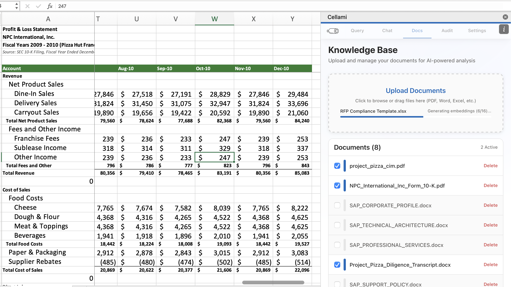
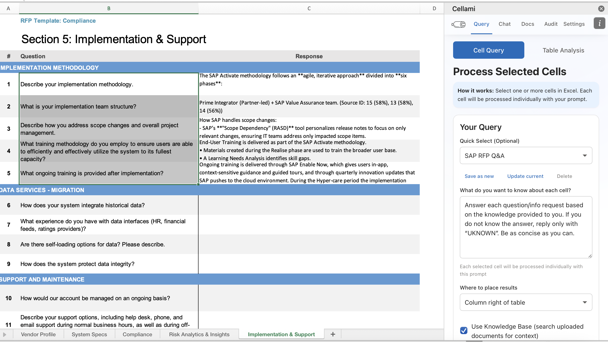
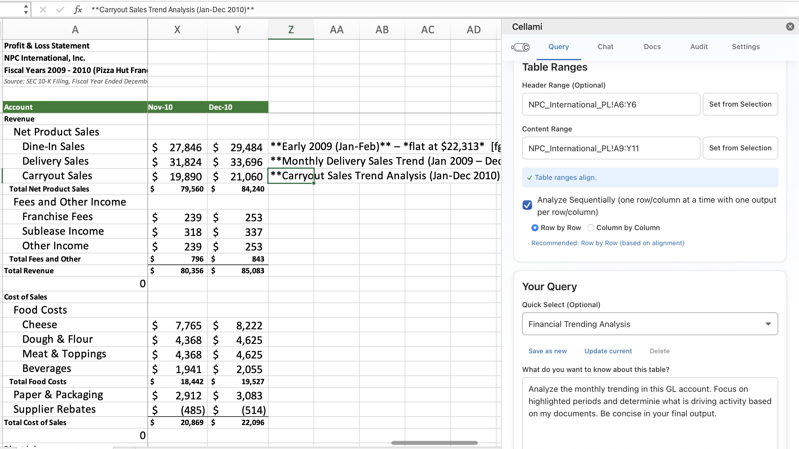
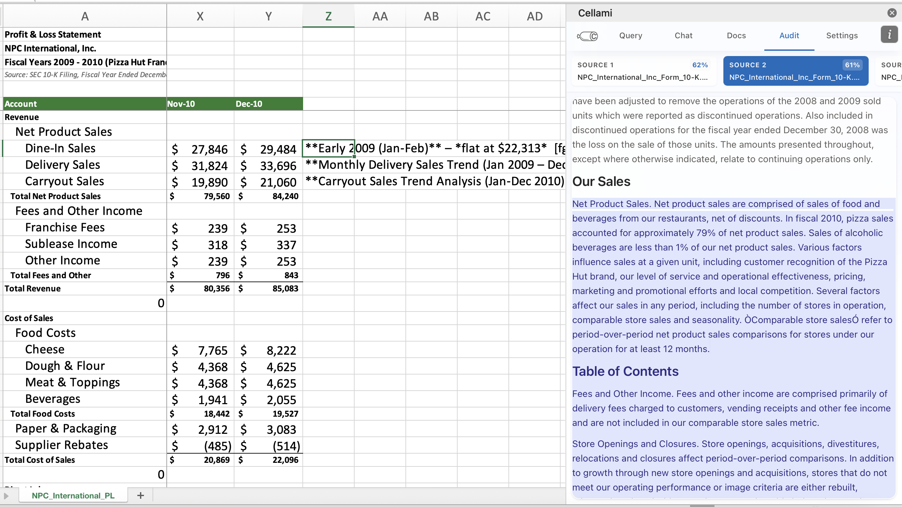
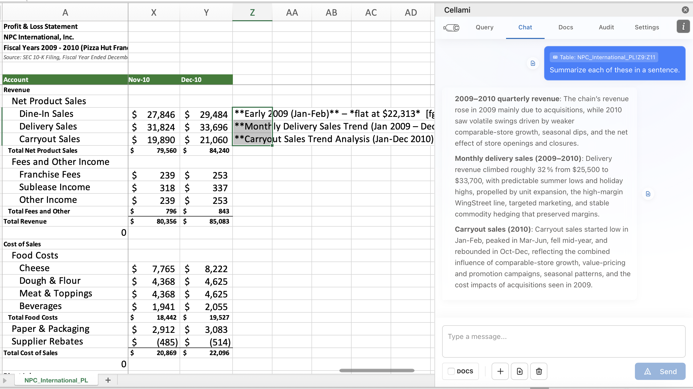

# Cellami: Local AI for Excel

**Cellami** is a private, local AI assistant that lives inside your Excel. It lets you chat with your data and documents without ever sending them to the cloud.

---

## 🚀 Features

### 1. Knowledge Base
Upload your own documents (PDFs, Word, etc.) and ask questions based on them. Cellami uses your local files to provide accurate, context-aware answers.


### 2. Query Cells
Select any cell in your spreadsheet and ask Cellami to process it. Perfect for quick analysis, summarization, or extraction tasks on specific data points. Activate the knowledge base for context-aware answers.


### 3. Query Tables
Analyze entire tables at once. Select a range of data, and Cellami will analyze the full table or individual entries sequentially to provide comprehensive insights. Activate the knowledge base for context-aware answers.


### 4. Audit Answers
Trace back every answer to its source. The Audit tab shows you exactly which document chunks were used to generate a response, ensuring transparency and trust.


### 5. Chat with Tables
Have a free-form conversation with your data. The Chat tab allows for open-ended questions and follow-ups, maintaining context throughout your session.



---

## 📦 Installation & Setup

Cellami runs entirely on your local machine. Follow these three steps to get started.

### 1. Install Ollama (Prerequisite)
Cellami uses **Ollama** to run AI models locally.
1. Download and install it from [ollama.com](https://ollama.com).
2. After installation, open your Terminal/PowerShell and download a model (we recommend `ministral-3:8b`):
   ```bash
   ollama pull ministral-3:8b
   ```

### 2. Run the Cellami Desktop App
Download the latest release for your system and launch the app.
*   **Mac:** Drag `Cellami.app` to your Applications folder and open it.
*   **Windows:** Unzip the folder and run `Cellami.exe`.
*   *Note: On both systems, look for the **Cellami icon** in your menu bar / system tray. The app runs in the background.*

### 3. Add Cellami to Excel
Once the app is running, you need to add the manifest file to Excel. This tells Excel where to find the local Cellami server.

**The manifest file is named `manifest.prod.xml` and is located in the `store_package` folder of this repository.**

There are two ways to add it:
*   **Excel on the Web (Easiest):** Go to **Insert** > **Add-ins** > **Upload My Add-in** and select the `manifest.prod.xml` file.
*   **Excel Verification (Sideloading):** If you are on desktop, you may need to sideload the manifest. Follow Microsoft's guide on [sideloading add-ins](https://learn.microsoft.com/en-us/office/dev/add-ins/testing/test-debug-office-add-ins#sideload-an-office-add-in-for-testing). Provide `manifest.prod.xml` when prompted.

---


## 🏗️ Development (For Contributors)

### Prerequisites
*   **Node.js** (for Frontend)
*   **Python 3.12+** (for Backend)

### Setup & Running
1.  **Backend:** `pip install -r requirements.txt && python main.py`
2.  **Frontend:** `cd frontend && npm install && npm run dev`

---

## 🏗️ Building (Distribution)

To create a standalone installer for your platform:

```bash
# 1. Install dependencies
pip install -r requirements.txt
cd frontend && npm install && cd ..

# 2. Run the build script
./scripts/build_app.sh  # macOS
.\scripts\build_app.bat # Windows
```
*Installer packages will be generated in the `dist/` directory.*

